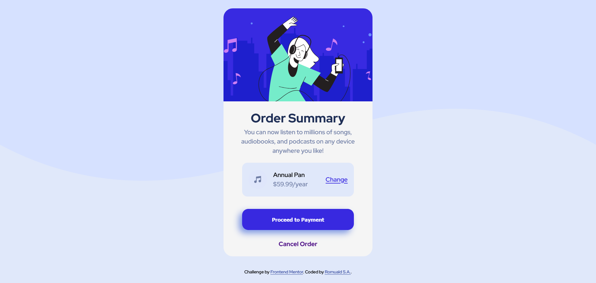

# FrontEnd Mentor Challenge: Order Summary card

This is a solution to the [Order summary card challenge on Frontend Mentor](https://www.frontendmentor.io/challenges/order-summary-component-QlPmajDUj). Frontend Mentor challenges help you improve your coding skills by building realistic projects.

## Table of contents

- [Overview](#overview)
  - [The challenge](#the-challenge)
  - [Screenshot](#screenshot)
  - [Links](#links)
- [My process](#my-process)
  - [Built with](#built-with)
  - [What I learned](#what-i-learned)
  - [Continued development](#continued-development)
  - [Useful resources](#useful-resources)
- [Author](#author)
- [Acknowledgments](#acknowledgments)

## Overview

### The challenge

Users should be able to:

- See hover states for interactive elements

### Screenshot


## My process

### Built with

- Semantic HTML5 markup
- CSS custom properties
- Flexbox
- CSS Grid

### What I learned

Through this project; I have learnt:

- How to reset and design CSS custom properties
- How to use CSS custom properties
- How to design CSS custom classes
- How to effcetive use flexbox and grid in altering the look of a web page
- How to use custom fonts (i.e: google fonts) in a web application
- How to render an svg file in the web (not the only way but one of the  many ways)
- How to design the structure of a web page (at least the basic stuffs)
- How to style a each structural elements using CSS3
    ```
    css
    .flex {
    display: flex;
    gap: var(--gap; 1rem)
    }
    ```
    Applying the designed flex to a div container in html.
    ```
    <div class="flex">
        <p>This is a paragraph</p>
        <div>another div</div>
    </div>
    ```

## Author

- Frontend Mentor - [@rsa015](https://www.frontendmentor.io/profile/rsa015)
- Twitter - [@rs_amegee](https://www.twitter.com/rs_amegee)